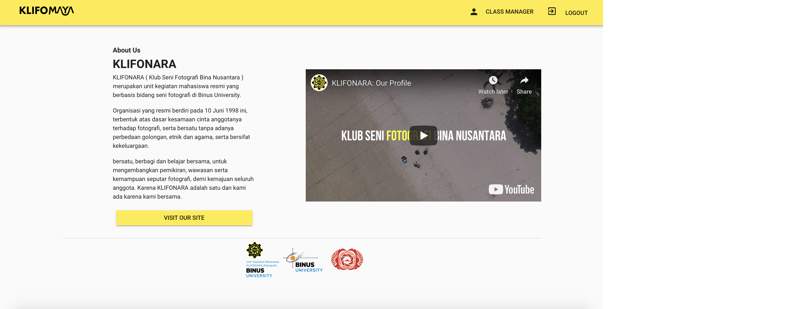
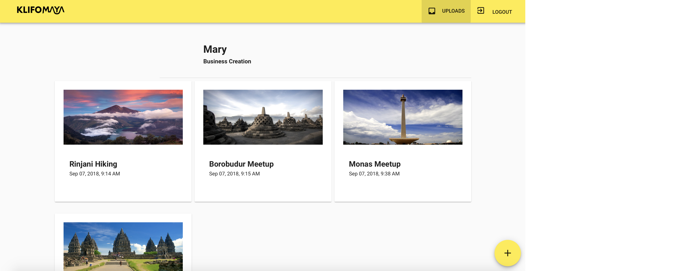

# klifomaya

Klifomaya is a VueJS-based project used to manage photography class needs of Binus University Photography Club (KLIFONARA). The project is meant to help teachers to assess students based on their attendance and assignments.

Klifomaya can be accessed by using accounts. User can sign up, and will be assigned to a class by their teacher.

Students can upload their photography assignments on the given section. They can give additional informations about the pictures, like their camera settings, date of picture taken, and title.

Teachers can monitor their students using Klifomaya. Teachers can track attendance, their personal informations, and their assignments through teacher's dashboard.

As for their database system, we used Firebase. It is a JSON-based data structure, which is simple and robust to use. Since the purpose of Klifomaya is to track attendance and assignments, we only need a simple data structure that can store personal informations, attendance and student's upload. Hence, we picked Firebase.